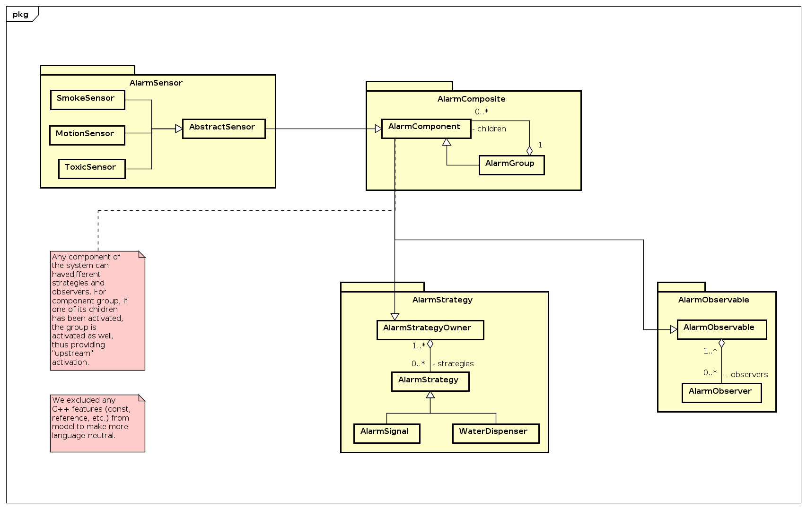
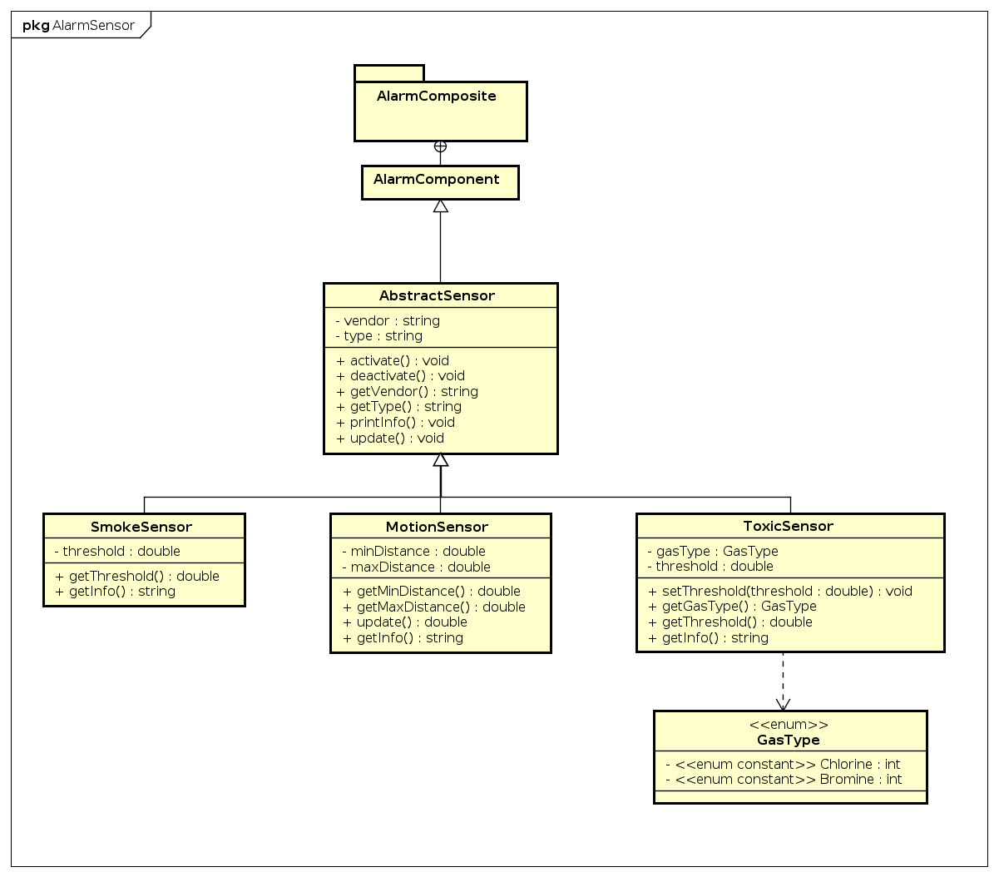
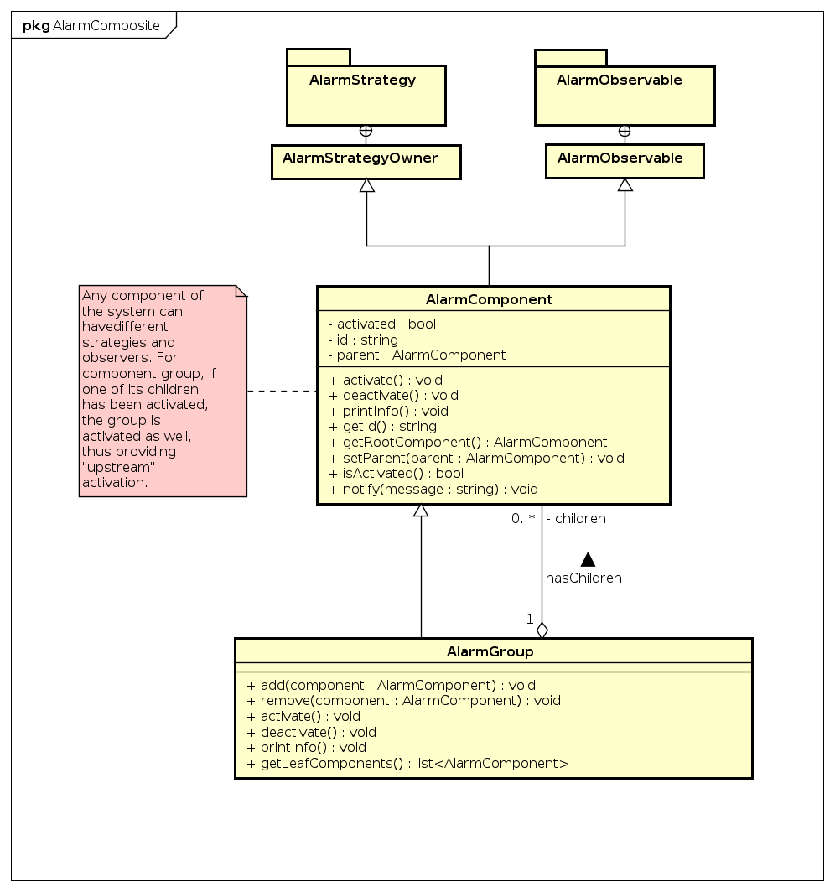
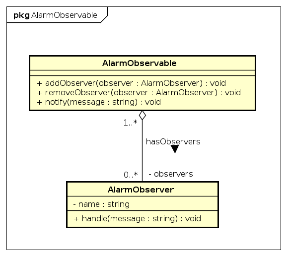
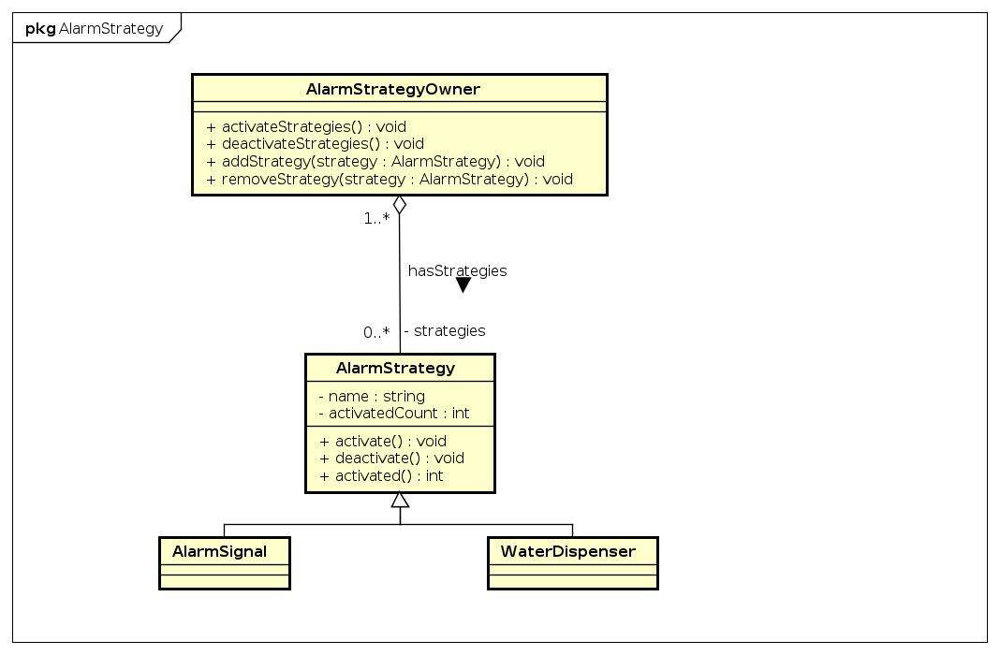

# Alarm system

## Description

This is the Alarm System implementation for Lab 2 of Media Processing course.
Following diagram represents the model of the system divided
into packages. Each package reprsesents separate module.

### Main class diagram:

## Documentation

Doxygen generated documentation is available in docs/html/index.html

## Project structure

### AlarmSensors

AlarmSensors group is located in `alarm-sensor`
directory and includes sensor classes, i.e.
`AbstractSensor` class, which defines common
attributes and operations and its different
implementation, for instance, `SmokeSensor` class.
Whenever new sensor class is created it is sufficient
that this class should be inherited from
`AbstractSensor` class, and `update()` function should
be defined.

Here is the class diagram of AlarmSensors package:

### AlarmComposite

AlarmComposite group is an implementation of
composite pattern. It is located in
`alarm-composite` directory. It includes base
component class `AlarmComponent` and its successor
class `AlarmComponentGroup`. Leaf implementation
`AbstractSensor` is a part of AlarmSensors group.

Here is the class diagram of AlarmComposite package:

### AlarmObserver

AlarmObserver group is located in
`alarm-observer`. It includes `AlarmObservable` class,
which is a base for any actual implementation of
observable objects.  The only difference between Observer and Strategy here is that Observer can handle a message coming from observable, when Strategy can only be activated/deactivated by strategy owner. Observer is implemented in
 `AlarmObserver` class. In order to create new
 alarm strategy, one must inherit it from
 `AlarmObserver` base class and optionally redefine `handle function`.

 Here is the class diagram of AlarmObserver package:

 

### AlarmStrategies

AlarmStrategies group is located in
`alarm-strategy`. It includes `AlarmStrategy` class,
which is a base for any actual implementation of
strategy. Context is implemented in
 `AlarmStrategyOwner` class. In order to create new
 alarm strategy, one must inherit it from
 `AlarmStrategy` base class.

 Here is the class diagram of AlarmStrategies package:

 

## TODO

* [x] Implement Composite structure (classes
  AlarmComponent, AlarmComponentGroup)
* [x] Implement Strategy structure ( classes    AlarmStrategy and AlarmStrategyOwner)
* [x] Implement AlarmSensor class
* [x] Implement AlarmStrategy successors
* [x] Implement AlarmSensor successors
  * [x] Implement SmokeSensor
  * [x] Implement MotionSensor
  * [x] Implement ToxicSensor
* [x] Create documentation
* [x] Reorganize project structure
* [x] Implement operators
  * [x] Implement operator++
  * [x] Implement operator--
  * [x] Implement operator<< for each type of sensor
* [x] Add activation flag to AlarmComponent and activation counter
to AlarmStrategy
* [x] Parent attribute for AlarmComponent
* [x] Implement Observer structure
* [x] Sorting and search algorithms
* [x] Add model to the project
* [x] Move sources to separate folder
